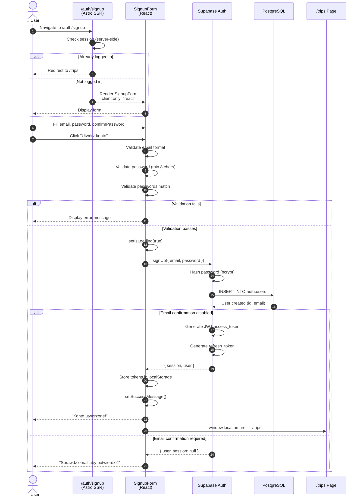
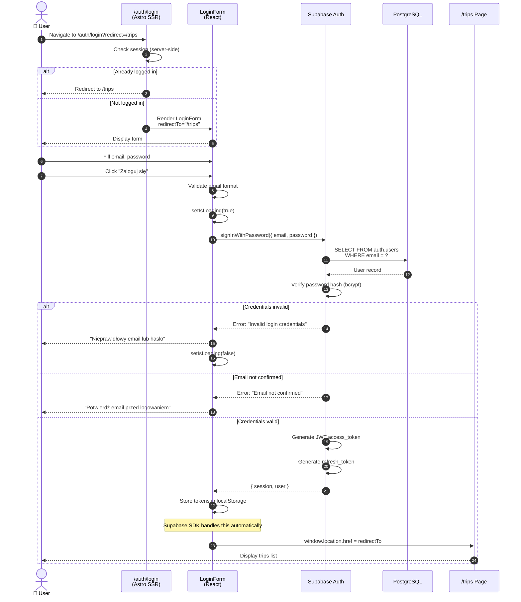
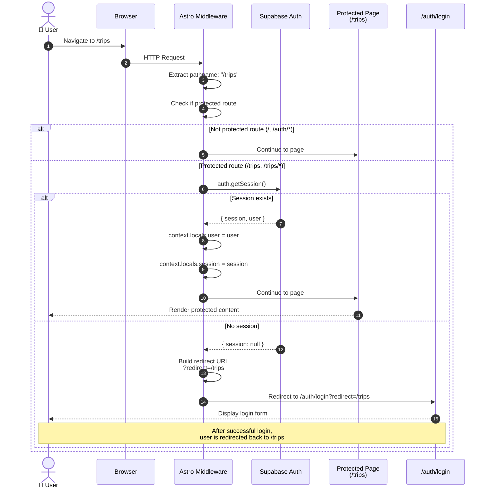
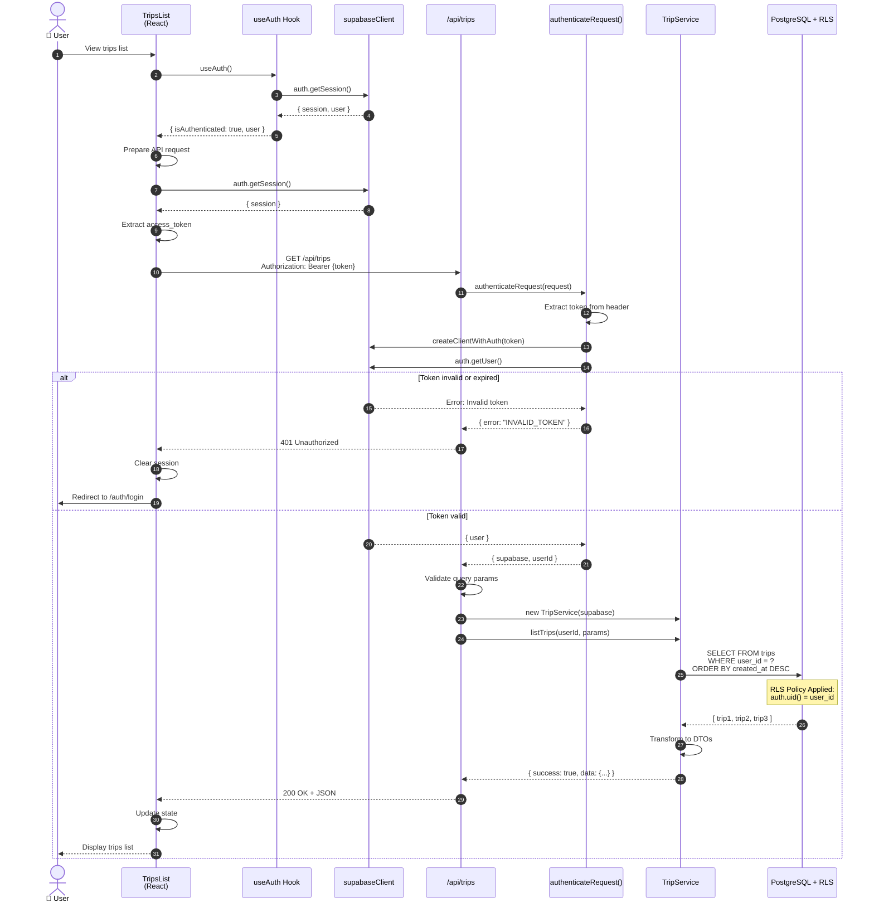
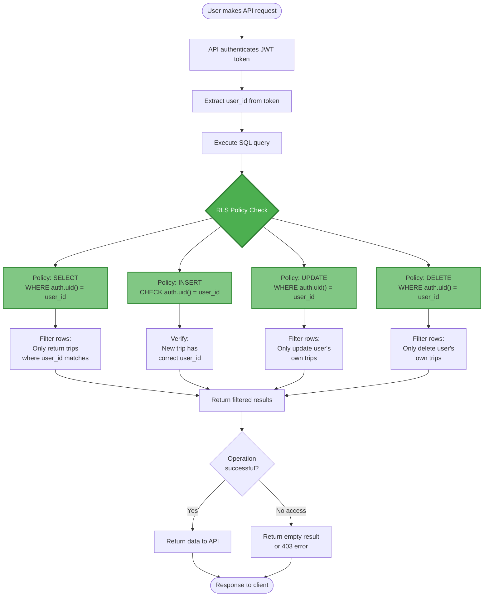
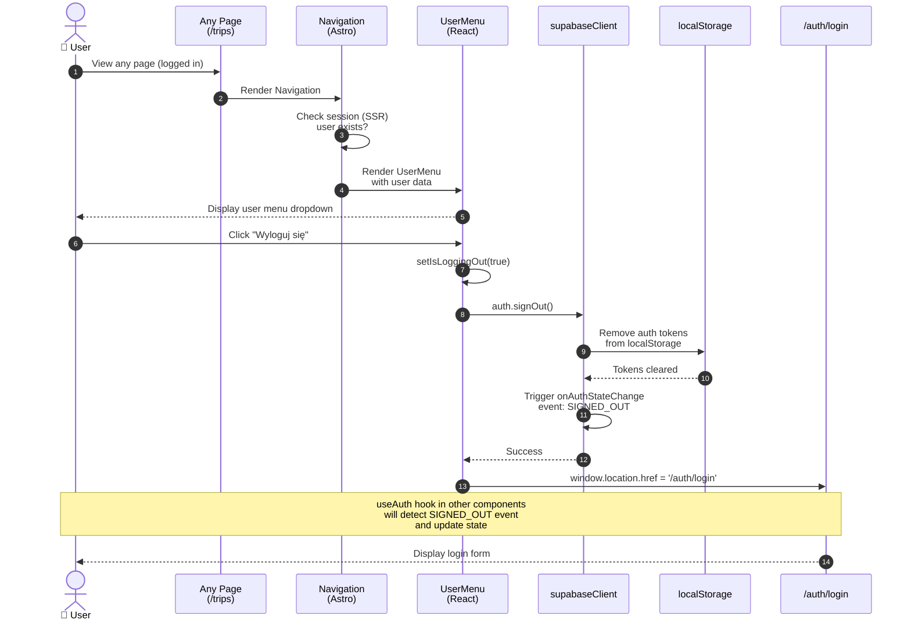
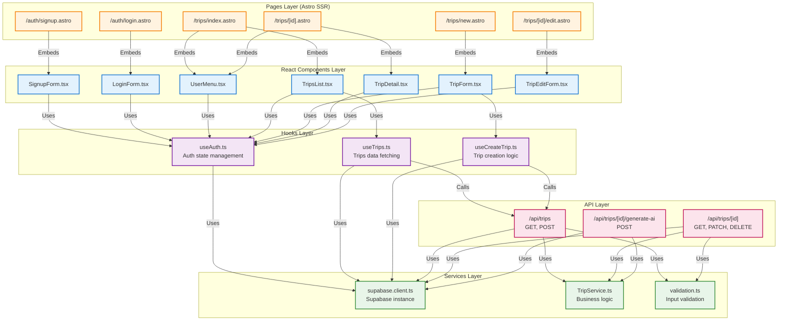
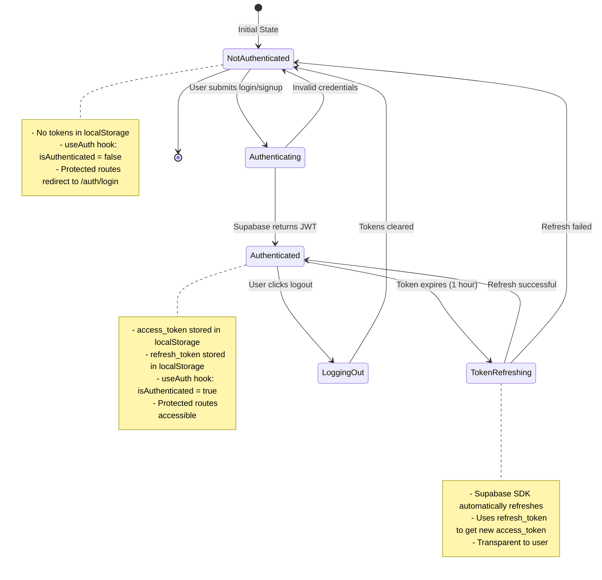
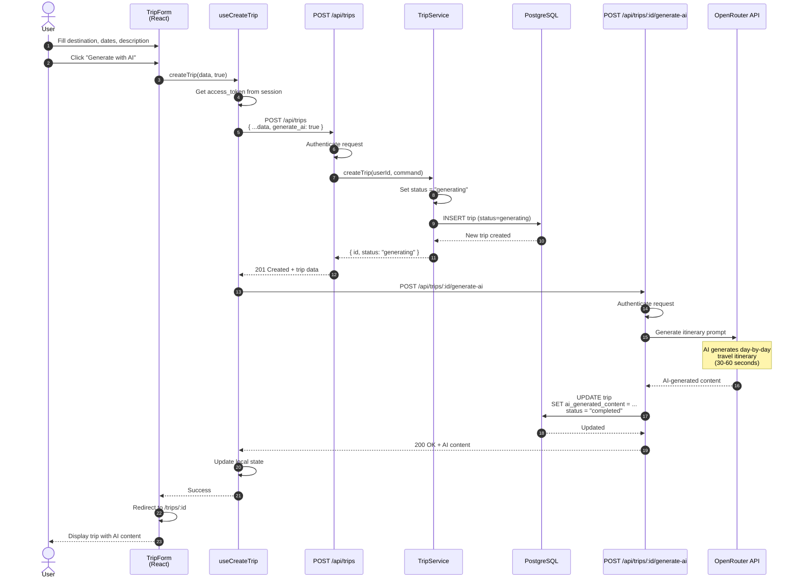
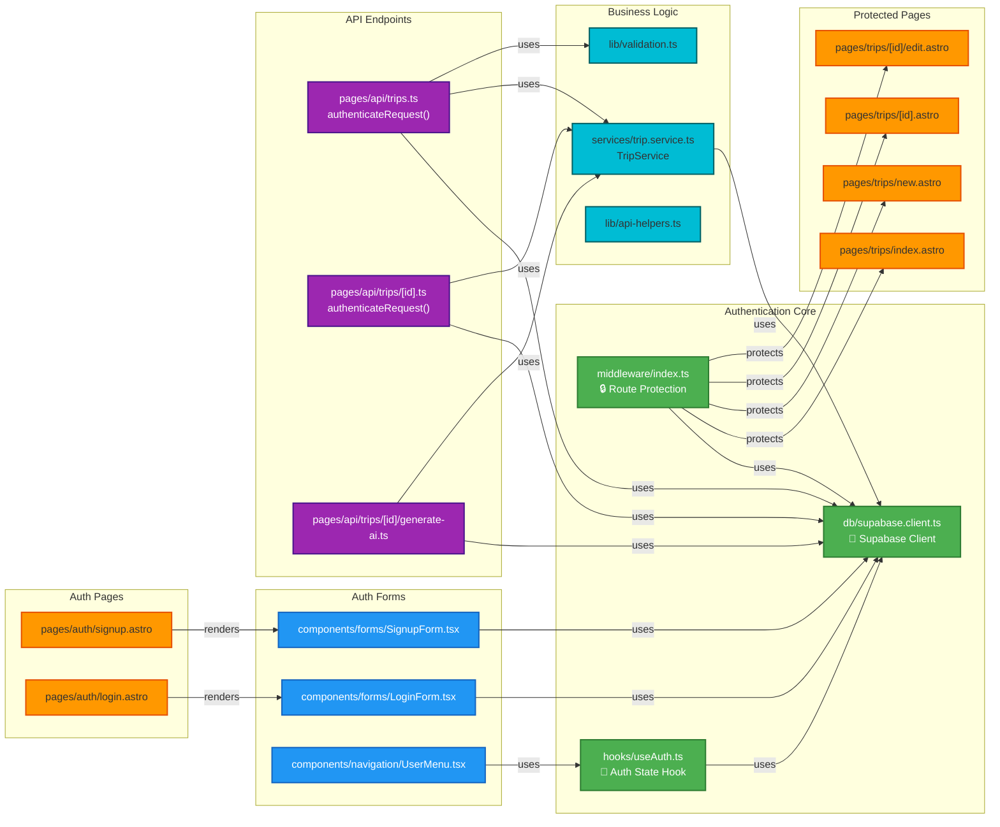

# Diagram Architektury Autentykacji - VibeTravels

## 1. Przegląd Architektury Systemu Autentykacji

```mermaid
graph TB
    subgraph "Client Layer - Browser"
        User[👤 User]
        SignupPage["/auth/signup<br/>Signup Page"]
        LoginPage["/auth/login<br/>Login Page"]
        TripsPage["/trips<br/>Trips List"]
        TripDetailPage["/trips/:id<br/>Trip Details"]

        SignupForm["SignupForm.tsx<br/>(React Component)"]
        LoginForm["LoginForm.tsx<br/>(React Component)"]
        UserMenu["UserMenu.tsx<br/>(React Component)"]
        TripsList["TripsList.tsx<br/>(React Component)"]

        useAuth["useAuth Hook<br/>(Client-side Auth State)"]
    end

    subgraph "Astro SSR Layer"
        Middleware["Middleware<br/>(index.ts)<br/>🔒 Protected Routes Check"]

        subgraph "Protected Pages"
            TripsIndexAstro["trips/index.astro"]
            TripsNewAstro["trips/new.astro"]
            TripDetailAstro["trips/[id].astro"]
            TripEditAstro["trips/[id]/edit.astro"]
        end

        subgraph "Auth Pages"
            SignupAstro["auth/signup.astro"]
            LoginAstro["auth/login.astro"]
        end
    end

    subgraph "API Layer"
        TripsAPI["API: /api/trips<br/>GET, POST"]
        TripByIdAPI["API: /api/trips/:id<br/>GET, PATCH, DELETE"]
        GenerateAIAPI["API: /api/trips/:id/generate-ai<br/>POST"]

        AuthHelper["authenticateRequest()<br/>JWT Token Validation"]
        TripService["TripService.ts<br/>Business Logic"]
        Validation["validation.ts<br/>Input Validation"]
    end

    subgraph "Supabase Backend"
        SupabaseAuth["Supabase Auth<br/>Authentication Service"]
        SupabaseDB["PostgreSQL Database<br/>with Row Level Security"]

        subgraph "Database Tables"
            UsersTable["auth.users<br/>(Managed by Supabase)"]
            TripsTable["public.trips<br/>(User Data)"]
        end

        RLSPolicies["RLS Policies<br/>🔒 User-specific filtering"]
    end

    subgraph "External Services"
        OpenRouter["OpenRouter API<br/>AI Content Generation"]
    end

    %% User interactions
    User -->|1. Navigate to| SignupPage
    User -->|2. Navigate to| LoginPage
    User -->|3. Access protected| TripsPage

    %% Signup flow
    SignupPage -->|Embeds| SignupForm
    SignupForm -->|signUp()| SupabaseAuth
    SupabaseAuth -->|Create user| UsersTable
    SupabaseAuth -->|Return JWT| SignupForm
    SignupForm -->|Redirect| TripsPage

    %% Login flow
    LoginPage -->|Embeds| LoginForm
    LoginForm -->|signInWithPassword()| SupabaseAuth
    SupabaseAuth -->|Verify credentials| UsersTable
    SupabaseAuth -->|Return JWT + session| LoginForm
    LoginForm -->|Store in localStorage| useAuth
    LoginForm -->|Redirect| TripsPage

    %% Protected route access
    TripsPage -->|SSR Request| Middleware
    Middleware -->|Check session| SupabaseAuth
    SupabaseAuth -->|Valid session?| Middleware
    Middleware -->|✅ Authorized| TripsIndexAstro
    Middleware -->|❌ Unauthorized| LoginPage

    %% Component rendering
    TripsIndexAstro -->|Renders| TripsList
    TripsList -->|useAuth| useAuth
    useAuth -->|getSession()| SupabaseAuth

    %% API calls with auth
    TripsList -->|GET /api/trips<br/>Bearer Token| TripsAPI
    TripsAPI -->|Validate token| AuthHelper
    AuthHelper -->|getUser()| SupabaseAuth
    SupabaseAuth -->|Return user| AuthHelper
    AuthHelper -->|Create client with token| TripService
    TripService -->|Query with RLS| SupabaseDB
    SupabaseDB -->|Apply RLS| RLSPolicies
    RLSPolicies -->|Filter by user_id| TripsTable
    TripsTable -->|Return user's trips| TripService
    TripService -->|Transform to DTO| TripsAPI
    TripsAPI -->|JSON response| TripsList

    %% Logout flow
    TripsPage -->|Embeds| UserMenu
    UserMenu -->|signOut()| SupabaseAuth
    SupabaseAuth -->|Clear session| useAuth
    UserMenu -->|Redirect| LoginPage

    %% AI generation
    TripsList -->|Create trip with AI| TripsAPI
    TripsAPI -->|Call| TripService
    TripService -->|Insert trip status=generating| TripsTable
    TripsList -->|POST /api/trips/:id/generate-ai| GenerateAIAPI
    GenerateAIAPI -->|Generate content| OpenRouter
    OpenRouter -->|Return AI content| GenerateAIAPI
    GenerateAIAPI -->|Update trip| TripsTable

    %% Styling
    classDef clientLayer fill:#e3f2fd,stroke:#1976d2,stroke-width:2px
    classDef astroLayer fill:#fff3e0,stroke:#f57c00,stroke-width:2px
    classDef apiLayer fill:#f3e5f5,stroke:#7b1fa2,stroke-width:2px
    classDef supabaseLayer fill:#e8f5e9,stroke:#388e3c,stroke-width:2px
    classDef externalLayer fill:#fce4ec,stroke:#c2185b,stroke-width:2px

    class User,SignupPage,LoginPage,TripsPage,TripDetailPage,SignupForm,LoginForm,UserMenu,TripsList,useAuth clientLayer
    class Middleware,TripsIndexAstro,TripsNewAstro,TripDetailAstro,TripEditAstro,SignupAstro,LoginAstro astroLayer
    class TripsAPI,TripByIdAPI,GenerateAIAPI,AuthHelper,TripService,Validation apiLayer
    class SupabaseAuth,SupabaseDB,UsersTable,TripsTable,RLSPolicies supabaseLayer
    class OpenRouter externalLayer
```

---

## 2. Szczegółowy Przepływ Rejestracji (US-001)



---

## 3. Szczegółowy Przepływ Logowania (US-002)



---

## 4. Przepływ Middleware i Ochrony Routes (US-011)



---

## 5. Przepływ Wywołania API z Autentykacją (CRUD Operations)



---

## 6. Przepływ Row Level Security (RLS) - US-012



---

## 7. Przepływ Wylogowania (US-003)



---

## 8. Architektura Komponentów



---

## 9. Stan Sesji i Przepływ Tokenów



---

## 10. Przepływ Danych - Create Trip z AI



---

## 11. Kluczowe Pliki i Ich Relacje



---

## 12. Podsumowanie Architektury

### 🔑 Kluczowe Komponenty:

1. **Middleware** (`src/middleware/index.ts`)
   - Sprawdza sesję przy każdym request
   - Chroni routes: `/trips`, `/trips/*`
   - Przekierowuje do `/auth/login?redirect=...`

2. **Supabase Client** (`src/db/supabase.client.ts`)
   - Singleton klienta Supabase
   - `createSupabaseClientWithAuth(token)` dla API calls
   - Auto-refresh tokenów

3. **useAuth Hook** (`src/hooks/useAuth.ts`)
   - Zarządzanie stanem autentykacji client-side
   - Nasłuchiwanie `onAuthStateChange`
   - Metoda `signOut()`

4. **Formularze Auth** (React Components)
   - `SignupForm.tsx` - rejestracja
   - `LoginForm.tsx` - logowanie
   - `UserMenu.tsx` - dropdown z wylogowaniem

5. **API Authentication Helper**
   - `authenticateRequest()` w każdym endpoincie
   - Walidacja JWT tokenu
   - Przekazanie `userId` do service layer

6. **Row Level Security** (PostgreSQL)
   - Polityki na tabeli `trips`
   - Automatyczne filtrowanie po `user_id`
   - Ochrona na poziomie bazy danych

### 🔐 Przepływ Autoryzacji:

```
User → Component → API (Bearer Token) → authenticateRequest()
→ Supabase.auth.getUser() → TripService → PostgreSQL + RLS
→ Filter by user_id → Return data → User
```

### ✅ Realizacja User Stories:

- **US-001** (Rejestracja): `SignupForm.tsx` → `Supabase Auth` → Auto-login
- **US-002** (Logowanie): `LoginForm.tsx` → `Supabase Auth` → Redirect
- **US-003** (Wylogowanie): `UserMenu.tsx` → `signOut()` → Clear session
- **US-011** (Protected routes): `Middleware` → Check session → Redirect
- **US-012** (Data protection): RLS policies → Filter by `auth.uid()`

---

**Koniec diagramów architektury autentykacji**